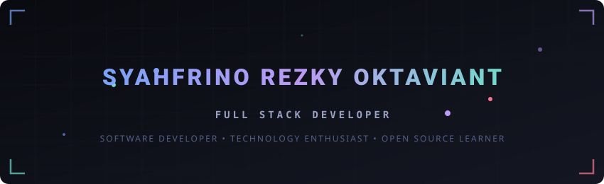
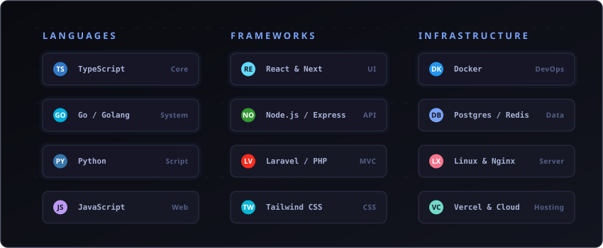

<!-- Premium GitHub Profile README | Tokyo Night Theme -->

  

  

  

  

## About Me

I am a passionate developer focused on building responsive, high-performance web applications and experimenting with modern tech stacks.

- 💻 **Full Stack Developer**: Building clean, scalable user interfaces and backend architectures.
- 🌐 **Open Source Learner**: Actively exploring public codebases and contributing to community projects.
- 🧠 **Builder of Useful Applications**: Creating developer tooling, automations, and productivity utilities.
- ⚡ **Technology Enthusiast**: Continuously learning new patterns, algorithms, and design paradigms.
- 🛠️ **Practical Architecture**: Adhering to clean code principles, simple structures, and test-driven workflows.

 

  

  

## Tech Stack & Skills

  

 

<table align="center" width="100%" style="border-collapse: collapse; border: none;">
  <tr style="border: none;">
    <td valign="top" width="50%" style="border: none; padding: 10px;">
      <h3>Languages</h3>
      
    </td>
    <td valign="top" width="50%" style="border: none; padding: 10px;">
      <h3>Frameworks &amp; Frontend</h3>
      
    </td>
  </tr>
  <tr style="border: none;">
    <td valign="top" width="50%" style="border: none; padding: 10px;">
      <h3>Backend &amp; Database</h3>
      
    </td>
    <td valign="top" width="50%" style="border: none; padding: 10px;">
      <h3>Tools &amp; DevOps</h3>
      
    </td>
  </tr>
</table>

  

## Currently Exploring

<table align="center" width="100%" style="border-collapse: collapse; border: none;">
  <tr style="border: none;">
    <td style="border: 1px solid #24283b; border-radius: 8px; padding: 20px; background-color: #0f111a;">
      <h3 style="margin-top: 0;">Next-Gen Microservices Architecture</h3>
      
Currently diving deep into distributed systems, event-driven architectures using Go, and real-time synchronization with WebSockets and Redis Pub/Sub.

      

        
        
        
      

    </td>
  </tr>
</table>

  

## GitHub Statistics

  
  

  

  

  

## Achievements

  

  

## Developer Quote

  

  

## Contribution Snake

  <picture>
    <source media="(prefers-color-scheme: dark)" srcset="https://raw.githubusercontent.com/niro1n/niro1n/output/github-contribution-grid-snake-dark.svg">
    <source media="(prefers-color-scheme: light)" srcset="https://raw.githubusercontent.com/niro1n/niro1n/output/github-contribution-grid-snake.svg">
    
  </picture>

  

## Connect With Me

  
  
  
  

  

  Crafted by <b>Syahfrino Rezky Oktaviant</b> · Tokyo Night Theme

