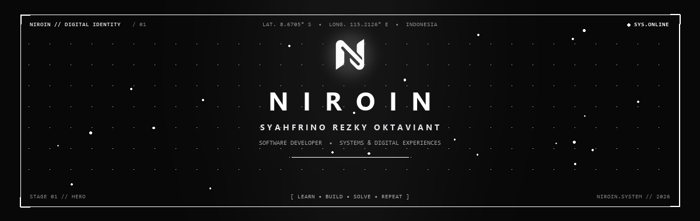

<p align="center">
  
</p>

<p align="center">
  
  &nbsp;
  
  &nbsp;
  
</p>

---

<h2 align="center">I BUILD DIGITAL EXPERIENCES.</h2>

<p align="center">
  Software developer crafting refined web systems, interactive applications, and thoughtful digital experiences.
</p>

---

### 01 ── PHILOSOPHY & VISION

> *"Technology should not exist just because it can. It should solve something, simplify something, or create something worth experiencing."*

| Index | Pillar | Principle |
| :---: | :--- | :--- |
| `01` | **SOLVE SOMETHING** | Resolve real-world complexity and deliver tangible utility. |
| `02` | **SIMPLIFY SOMETHING** | Remove friction, eliminate unnecessary noise, and make interaction intuitive. |
| `03` | **CREATE SOMETHING** | Craft digital systems with tactile depth, spatial rhythm, and memorable craft. |

```text
CADENCE // LEARN ───> BUILD ───> SOLVE ───> REPEAT
```

---

### 02 ── TECHNOLOGY STACK

```text
LANGUAGES
PHP · JavaScript · TypeScript · Java · Lua

FRAMEWORKS & UI
Laravel · Next.js · React · React Native · Flutter

SYSTEMS & DATA
Docker · Git & GitHub · MySQL · PostgreSQL · Tailwind CSS
```

| Domain | Core Stack | Status |
| :--- | :--- | :--- |
| **Languages** | `PHP` &bull; `JavaScript` &bull; `TypeScript` &bull; `Java` &bull; `Lua` | Primary Standard |
| **Frameworks** | `Laravel` &bull; `Next.js` &bull; `React` &bull; `React Native` &bull; `Flutter` | Production Stack |
| **Ecosystem** | `Docker` &bull; `Git & GitHub` &bull; `MySQL` &bull; `PostgreSQL` &bull; `Tailwind CSS` | Daily Infrastructure |

---

### 03 ── JOURNEY

```text
2020 ───────────────────────────────────────────────> PRESENT [ FREELANCE // CONTINUOUS ]
2024 [ IT SUPPORT ] ──> 2025–2026 [ IT CORE ] ──> 2026–PRESENT [ IT HEAD ]
```

#### Professional Track
- **2026 — PRESENT** &bull; `IT HEAD` *(Stage 03 // Leadership)*  
  Technical direction, system governance, operational leadership, and technology initiative execution.
- **2025 — 2026** &bull; `IT CORE` *(Stage 02 // Expansion)*  
  System architecture & development, IT infrastructure scaling, database operations, and process automation.
- **2024** &bull; `IT SUPPORT` *(Stage 01 // Foundation)*  
  System troubleshooting, user operations, hardware diagnostics, and foundational infrastructure.

#### Independent Track
- **2020 — PRESENT** &bull; `FREELANCE DEVELOPER` *(Parallel Path // Est. 2020)*  
  Continuous independent creation alongside the professional career — building bespoke web applications, interactive UI/UX systems, and tailored digital solutions.

---

### 04 ── GITHUB CADENCE

Public codebases, architectural experiments, and ongoing contributions.

<p align="center">
  <picture>
    <source media="(prefers-color-scheme: dark)" srcset="https://raw.githubusercontent.com/niro1n/niro1n/output/github-contribution-grid-snake-dark.svg">
    <source media="(prefers-color-scheme: light)" srcset="https://raw.githubusercontent.com/niro1n/niro1n/output/github-contribution-grid-snake.svg">
    
  </picture>
</p>

---

### 05 ── CONNECT

<p align="center">
  <a href="https://github.com/niro1n">
    
  </a>
  &nbsp;
  <a href="https://instagram.com/rinorezky">
    
  </a>
  &nbsp;
  <a href="mailto:syahfrino.rezky@gmail.com">
    
  </a>
</p>

---

<p align="center">
  <sub>&copy; 2026 NIROIN &bull; SYAHFRINO REZKY OKTAVIANT &bull; CRAFTED WITH RESTRAINT</sub>
</p>
